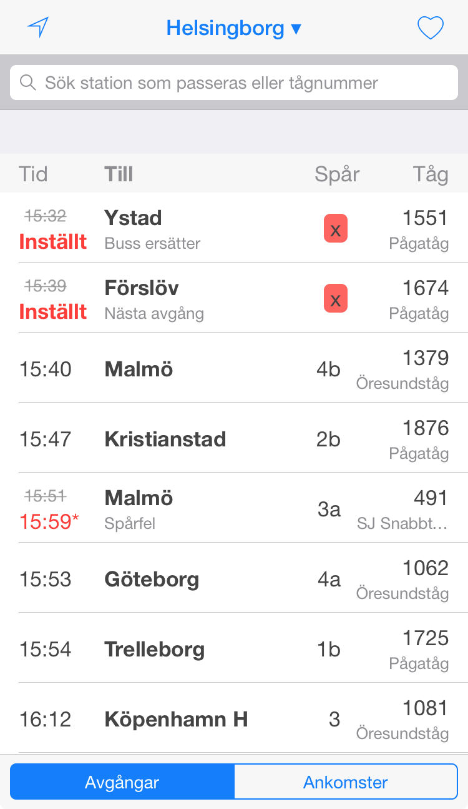

# [Snabbtåg](https://xn--snabbtg-jxa.nu/)
A minimalistic (progressive) web app for Swedish train times built using [preact-cli](https://github.com/developit/preact-cli).

The app has exactly one runtime dependency, [Preact](https://preactjs.com/), and care has been taken to keep it slim. Therefore its js bundle weighs in at < 60 kb in total (minified, pre-gzip). This means that the whole app is less than half the size of just [React](https://facebook.github.io/react/) itself, and it's also smaller than libraries such as [Vue.js](https://vuejs.org/) and [jQuery](https://jquery.com/). 

The styles are extracted from [Framework7](http://framework7.io/) and trimmed using [Chrome's Coverage tool](https://developers.google.com/web/updates/2017/04/devtools-release-notes#coverage), weighing in at < 25 kb (minified, pre-gzip).

## Features
* Show an auto-updating list of departures/arrivals for any station in Sweden, with detailed info and near-realitme deviations
* Filter by frequented stations or train numbers.
* Go into a specific departure/arrival to see all trip details, also in an auto-updating list
* Search for stations and trains
* Add favorites
* Locate nearest station

## Background
The app started out as a hack, and has grown organically ever since. At some point, I should probably have thrown away the prototype and started over, but I had too much fun 😬 As the code has been optimized for me having fun and learning new stuff, it's way more unreadable and arrogant than it should, but please bear with me.

## Performance vs Complexity
Although I chose [preact-cli](https://github.com/developit/preact-cli) because of its laser focus on performance and its fancy magic tricks to achieve it, it has turned out the app is so small that I don't really need most of them. For example, the magic route splitting and async components apparently aren't worth it. They don't actually make any tangible difference in performance, but do add some complexity and moving parts, so I've ditched them. Neither does it make a lot of sense from a performance perspective to componentize the CSS using CSS-in-JS techniques, since it's already so small, and so generic to all views.

It's worth noting that although I started out with [preact-router](https://github.com/developit/preact-router), it's not used anymore since it was bigger than necessary, but still didn't have the features I wanted. So I extracted some parts of it and tailored my own regexp based routing instead, to support routing [/422](https://xn--snabbtg-jxa.nu/422) to the train of the same number, but [/Göteborg](https://xn--snabbtg-jxa.nu/Göteborg) to the station of the same name. Doing this made me realize basic SPA routing is neither magic, nor hard 😊

## State
All persistent state is stored in the url, and navigating around and toggling switches mutates it accordingly. This means you can bookmark anything and get back to where you where, or eg. add a certain station and filter to your mobile's Home Screen for quick access. I even had an experimental branch with full server rendering, meaning that the whole app and pretty much all of its interactions would work with JS disabled.

## Trafikverket's API
It's [Trafikverket's API](https://api.trafikinfo.trafikverket.se/) that powers this app. Using it is a pretty weird experience, with a high threshold, since you use it by POST:ing queries written in [their clunky, XML-based DSL](https://api.trafikinfo.trafikverket.se/API/TheRequest). On the upside, this makes it really powerful, and it's responding surprisingly fast. Think of it as an XML-based SQL subset or something like that. The queries are pretty verbose though, so ~20 kb of the app could actually be extracted into a tailored server instead, which I had a WIP branch for, powered by server-sent events.

Unfortunately, Trafikverket's API currently mandates setting a `Content-Type: text/xml` header, resulting in the request not being considered [simple from a CORS perspective](https://developer.mozilla.org/en-US/docs/Web/HTTP/Access_control_CORS#Simple_requests), instead mandating preflighting every API request 😔 [I've asked them to change this](https://api.trafikinfo.trafikverket.se/Forum/Details/59a3da750bb22115d03e63a5), and they've promised to look into it some time.

## Server rendering
Currently, only the static Station list is server rendered, but there's an experimental branch with full server rendering partially working.

## Hosting
[https://snabbtåg.nu](https://xn--snabbtg-jxa.nu/) is hosted using [Firebase Hosting](https://firebase.google.com/products/hosting/), since it has HTTP2 Server Push support and [`preact-cli`](https://github.com/developit/preact-cli) can create the necessary config file to make it fly.